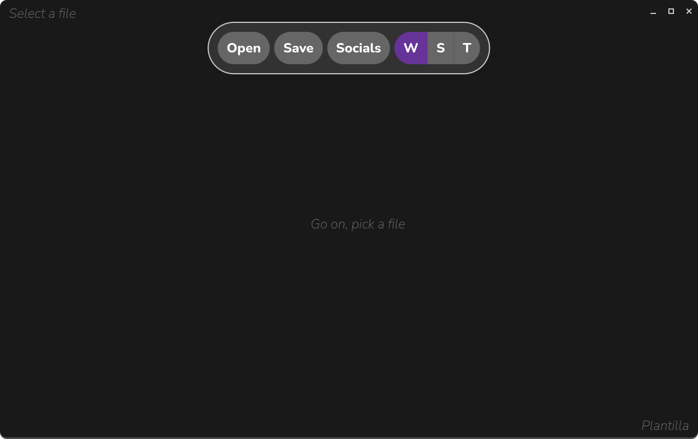

# Plantilla

<center>A simple tool for cropping and applying templates to images.</center>



## How to run
The project is built with vite and vanilla js made to work right on the browser
```bash
npm install
npm run dev
```
## Building for Arch Linux
Plantilla is built for Arch, using the system wide electron
To build it you may: 
- Download or copy the pacman folder
- `makepkg -si` as with any AUR package
- Or install `plantilla-git` with your preferred AUR helper
